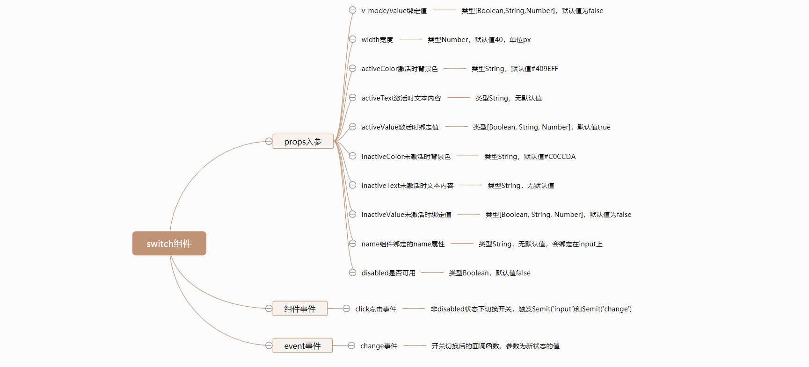

# Switch 开关

## 逻辑分析
要整理`Switch`组件的实现逻辑，我们从以下几个方面开始：
* `props`入参：对于每一个参数的类型，默认值以及描述。
* 组件`event`事件：组件自身的事件，例如`click`。
* 组件`$emit`事件：组件向父组件触发的事件，例如`change`事件。

根据以上的分类，我们使用[百度脑图](https://naotu.baidu.com/)，整理后的逻辑分析如下：
<br/>
<br/>


## 组件开发

### 准备
划分好实现步骤后，我们需要做一些前期的准备工作，按照我们在[准备](/guide/components/#开发规则)中提到的目录结构和规则，我们需要做以下步骤：

在`src/base`目录下新建`switch`目录，并在新建的`src/base/switch`目录中，再新建两个文件，分别是`index.js`和`switch.vue`。
```sh
# 新建 switch目录
$ mkdir switch

# 新建index.js和switch.vue文件
$ cd star
$ touch index.js
$ touch switch.vue
```
新建完毕后，`src/base`目录结构如下
```sh
|-- base
|   |-- star
|   |   |-- index.js
|   |   |-- star.vue
|   |-- badge
|   |   |-- index.js
|   |   |-- badge.vue
|   |-- switch
|   |   |-- index.js
|   |   |-- switch.vue
```
同时我们为`switch.vue`文件，撰写以下基础代码：
::: warning
组件注册部分参考`Star`组件。
:::
```html
<template>
  <div class="mooc-switch">
    switch
  </div>
</template>
```
```vue
<script>
export default {
  name: 'MoocSwitch'
}
</script>
```
在以上步骤都正确完成后，我们在任意已经注册路由过的页面，使用`mooc-switch`组件，当出现`switch`文本内容即意味着`Switch`组件已经全局注册成功了。

### 基础实现
::: tip
`Switch`组件中的`value`需要支持`v-model`。
:::
根据我们个人对于`Switch`组件最主要的功能理解，我们将`props`属性和`event`事件做如下划分：

`props`入参：
* `value`：开关的绑定值。
* `width`开关的大小
* `disabled`：是否禁用。
* `activeValue`：激活时的绑定值。
* `inactiveValue`：未激活时的绑定值。

`event`事件：
* `click`：鼠标点击事件。

根据以上划分，我们的基础`html`结构代码如下：
```html
<div
  class="mooc-switch"
  :class="{
    'is-disabled': disabled,
    'is-checked': checked
  }"
  @click.prevent="handleSwitchClick"
>
  <input
    ref="checkbox"
    type="checkbox"
    class="mooc-switch-input"
    @change="handleInputChange"
  >
  <span
    ref="SwitchRadius"
    class="mooc-switch-radius"
    :style="{
      width: `${width}px`
    }"
  ></span>
</div>
```

基础`javascript`代码如下：
```js
export default {
  name: 'MoocSwitch',
  props: {
    value: {
      type: [Boolean, String, Number],
      default: false
    },
    width: {
      type: Number,
      default: 40
    },
    disabled: {
      type: Boolean,
      default: false
    },
    activeValue: {
      type: [Boolean, String, Number],
      default: true
    },
    inactiveValue: {
      type: [Boolean, String, Number],
      default: false
    }
  },
  computed: {
    checked () {
      return this.value === this.activeValue
    }
  },
  mounted () {
    this.$refs.checkbox.checked = this.checked
  },
  methods: {
    handleSwitchClick () {
      if (this.disabled) {
        return false
      }
      this.handleInputChange()
    },
    handleInputChange () {
      const val = this.checked ? this.inactiveValue : this.activeValue
      this.$emit('input', val)
      this.$emit('change', val)
      this.$nextTick(() => {
        this.$refs.checkbox.checked = this.checked
      })
    }
  }
}
```

#### 代码分析：
* `v-model`：在`Vue`官网中我们很容易了解到，让一个组件支持`v-model`的话，应该满足什么条件。所以我们需要在组件中使用一个`checkbox`标签以及在代码中需要`$emit('input')`事件。
* `checked`: 我们将`checked`定义为计算属性，用`value`的值和`activeValue`的值来判断`switch`组件处于开和关哪种状态。同时我们需要把这个值，绑定到原生`checked`标签之上。
* `click`：在`switch`组件中，我们通过点击来切换开关的值，所以在`click`事件中我们首先需要判断组件是否处于`disabled`状态，如果不是则调用`handleInputChange`方法，这个方法里面主要的作用是向外触发事件。同时需要特别注意的是：在`handleInputChange`方法中，我们向外触发的值是最新的值，而不是当前值，类似于"取反"的操作。
```js
// is ok
const val = this.checked ? this.inactiveValue : this.activeValue
// is error
// const val = this.checked ? this.activeValue : this.inactiveValue
this.$emit('input', val)
this.$emit('change', val)
```

在撰写完`html`结构和`js`代码后，我们需要撰写我们的`css`代码：
::: tip
我们把`Switch`组件中关于变量的定义全部放在`src/assets/theme/src/switch-variables.styl`文件中，如果你没有此文件，需要新建。
:::
`Switch`组件中定义的变量如下：
```stylus
$switch-radius-height = 20px
$switch-radius-btn-size = 16px
$switch-radius-border-radius = 10px
$switch-radius-border-width = 1px
$switch-radius-border-style = solid
$switch-radius-offset = 1px;
$switch-label-font-size = 14px
$switch-label-margin = 10px
$switch-transition-duration = 0.3s
$switch-disabled-opacity = 0.6
```
`Switch`组件基础`css`代码：
```stylus
@import '~assets/theme/variables.styl';
@import '~assets/theme/src/switch-variables.styl';
.mooc-switch
  position: relative;
  display: inline-flex;
  align-items: center;
  vertical-align: middle;
  &.is-checked
    .mooc-switch-radius
      background-color: $base-primary;
      border-color: $base-primary;
      &::after
        left: 100%;
        margin-left: unit(- $switch-radius-border-width - $switch-radius-btn-size, 'px');
  &.is-disabled
    pointer-events: none;
    .mooc-switch-radius
      opacity: $switch-disabled-opacity;
      cursor: not-allowed;
  .mooc-switch-input
    width: 0;
    height: 0;
    opacity: 0;
  .mooc-switch-radius
    display: inline-block;
    vertical-align: middle;
  .mooc-switch-radius
    position: relative;
    height: $switch-radius-height;
    line-height: $switch-radius-height;
    background-color: $base-info;
    border: $switch-radius-border-width $switch-radius-border-style $base-info;
    border-radius: $switch-radius-border-radius;
    box-sizing: border-box;
    cursor: pointer;
    &::after
      content: '';
      position: absolute;
      left: $switch-radius-offset;
      top: $switch-radius-offset;
      width: $switch-radius-btn-size;
      height: $switch-radius-btn-size;
      background-color: #fff;
      border-radius: $base-border-radius-circle;
      transition: all $switch-transition-duration;
```

实现完以上基础代码后，我们使用如下测试代码对`Switch`组件进行测试：
```html
<mooc-switch v-model="value"></mooc-switch>
```
```js
export default {
  name: 'home',
  data () {
    return {
      value: true
    }
  }
}
```
测试结果如下：
<br/>
<br/>

### 组件完善

### 组件测试

## 未来计划

## 组件文档